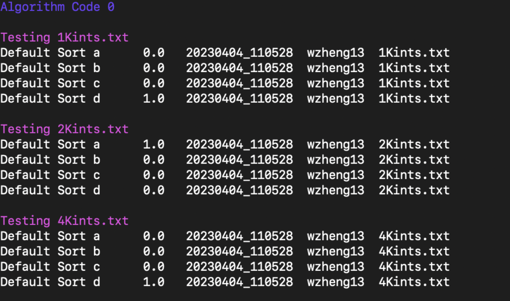
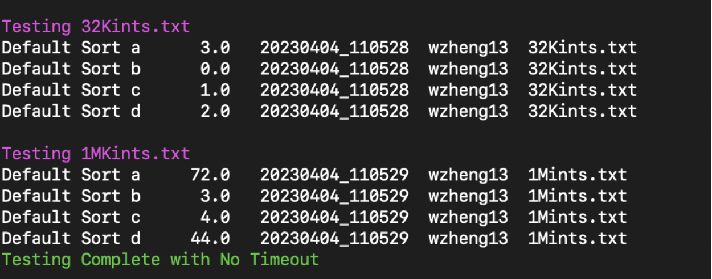

# Tools for CSC 172

This repository include some tools that you might find helpful in CSC172 Data Structures and Algorithms at University of Rochester.

</br>

---

## automate.sh

A bash file that help you automate the runtime testing process for different sorting algorithms in Lab5 of Spring 2023, It might be a different lab in other years. This script will save you tremendous time and effort in writing your lab repor. If you are tired of running the java file from terminal 42 times (6 sorting algorithms and 7 input files with various of sizes) and having to use a timer to wait for 10 minutes before ending the program on a certain sorting method for timeout, you can use this script to automate the process.

Setup:

- Navigate to the folder where your class files are located. It will be in the "out" folder for IntellJ and "bin" for Eclipse, or some other name if you are using a different IDE.
- Create a new file and copy the code into the file. If you are in the terminal, you can use vim.
- Run

```Bash
chmod u+x automate.sh
./automate.sh
```


...

